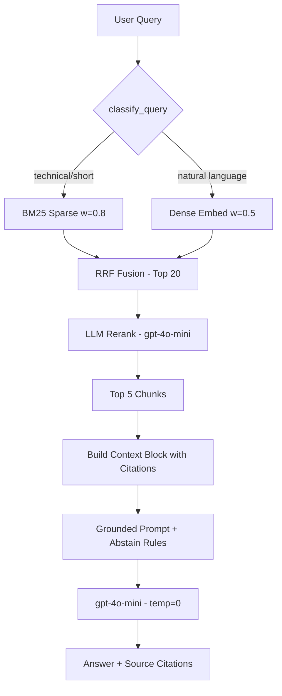

# Architecture -- RAG Pipeline (Day 08 Lab)

## 1. Tổng quan kiến trúc

```
[5 txt files in data/docs/]
        |
[index.py: Preprocess -> Section-based Chunk -> Embed -> Store]
        |
[ChromaDB Vector Store  (30 chunks, cosine)]
        |
[rag_answer.py: Query -> Dense/Hybrid Retrieve -> LLM Rerank -> Generate]
        |
[Grounded Answer + Citation [n]]
```

**Mô tả ngắn gọn:**
Hệ thống trợ lý nội bộ cho khối CS + IT Helpdesk. Nhân viên đặt câu hỏi về chính sách (hoàn tiền, SLA, cấp quyền, nghỉ phép, FAQ IT) và pipeline trả về câu trả lời có trích dẫn nguồn từ 5 tài liệu nội bộ. Khi không đủ dữ liệu, pipeline từ chối trả lời (abstain) thay vì bịa.

---

## 2. Indexing Pipeline (Sprint 1)

### Tài liệu được index
| File | Nguồn | Department | Số chunk |
|------|-------|-----------|---------|
| `policy_refund_v4.txt` | policy/refund-v4.pdf | CS | 6 |
| `sla_p1_2026.txt` | support/sla-p1-2026.pdf | IT | 5 |
| `access_control_sop.txt` | it/access-control-sop.md | IT Security | 8 |
| `it_helpdesk_faq.txt` | support/helpdesk-faq.md | IT | 6 |
| `hr_leave_policy.txt` | hr/leave-policy-2026.pdf | HR | 5 |
| **Tổng** | | | **30** |

### Quyết định chunking

**Chiến lược cuối cùng (Variant 2): Section-based chunking thuần túy**

| Tham số | Giá trị | Lý do |
|---------|---------|-------|
| Chunk size | 500 tokens (cấp trên) | Đủ rộng để giữ nguyên toàn bộ section, section lớn nhất ~150 tokens, không section nào bị cắt |
| Overlap | 50 tokens | Thấp vì split tại ranh giới section tự nhiên, không cần overlap lớn |
| Chunking strategy | Section-based (`=== ... ===`) | Mỗi section là 1 đơn vị ngữ nghĩa hoàn chỉnh (điều khoản, quy trình, FAQ topic). Giữ nguyên cấu trúc bullet/newline gốc |
| Prefix | `Tài liệu: {title} / Mục: {section}` | Thêm context cho embedding, giúp retrieval biết chunk thuộc tài liệu/mục nào |
| Metadata fields | source, section, effective_date, department, access, title, index | Phục vụ filter, freshness, citation |

**So sánh 2 chiến lược chunking đã thử:**

| | V1: Semantic Split (cũ) | V2: Section-based (hiện tại) |
|---|---|---|
| API calls để chunk | ~30 (embed từng câu qua OpenAI) | **0** |
| Tốc độ build index | Chậm (~60s) | **Nhanh (~18s)** |
| Format trong chunk | Flat 1 dòng (mất bullet/newline) | **Giữ nguyên cấu trúc gốc** |
| Ranh giới chunk | Theo cosine similarity của câu | **Theo section tự nhiên của tài liệu** |
| Số chunks | 30 | 30 |

**Lý do chọn Section-based:**
- Corpus nhỏ (5 docs, ~31 sections, mỗi section 100-600 chars), không cần chia nhỏ hơn.
- Sections chính là ranh giới ngữ nghĩa tự nhiên của tài liệu (điều khoản, quy trình, FAQ topic).
- Semantic split phá hủy cấu trúc dòng gốc (`.replace("\n", " ")`) khiến LLM khó đọc bullet points và format Q&A.
- Tiết kiệm ~30 API calls chỉ để chunking, không cần thiết cho corpus nhỏ.

### Embedding model
- **Model**: OpenAI `text-embedding-3-small` (1536 dims)
- **Vector store**: ChromaDB (PersistentClient, persistent on disk tại `chroma_db/`)
- **Similarity metric**: Cosine (`hnsw:space: cosine`)

---

## 3. Retrieval Pipeline (Sprint 2 + 3)

### Baseline (Sprint 2)
| Tham số | Giá trị |
|---------|---------|
| Strategy | Dense (embedding cosine similarity) |
| Top-k search | 10 |
| Top-k select | 3 |
| Rerank | Không |
| Chunking | Semantic split + section-based + recursive |

### Variant 1 -- Smart Hybrid (Sprint 3)
| Tham số | Giá trị | Thay đổi so với baseline |
|---------|---------|------------------------|
| Strategy | Hybrid (Dense + BM25, RRF fusion) | Dense -> Hybrid |
| Dense/Sparse weight | Dynamic (classify_query: 0.5/0.5 default, 0.2/0.8 cho technical query) | Mới |
| Top-k search | 20 | 10 -> 20 |
| Top-k select | 5 | 3 -> 5 |
| Rerank | LLM rerank (gpt-4o-mini chọn top-5 từ 20 candidates) | Không -> Có |
| Query transform | Không | -- |
| Chunking | Không đổi (vẫn là semantic split) | -- |

**Lý do chọn Hybrid + LLM Rerank:**
Corpus có cả câu tự nhiên (chính sách hoàn tiền, nghỉ phép) lẫn keyword kỹ thuật (SLA P1, ERR-403, Approval Matrix). Dense search bỏ lỡ exact keyword match, còn BM25 thuần túy bỏ lỡ ngữ nghĩa. Hybrid kết hợp cả hai. LLM rerank lọc nhiễu từ 20 candidates xuống 5 chunk thực sự liên quan.

### Variant 2 -- Section-based Chunking (Tuning chunking)
| Tham số | Giá trị | Thay đổi so với variant 1 |
|---------|---------|--------------------------|
| Strategy | Hybrid (giữ nguyên) | -- |
| Top-k search | 20 (giữ nguyên) | -- |
| Top-k select | 5 (giữ nguyên) | -- |
| Rerank | LLM rerank (giữ nguyên) | -- |
| **Chunking** | **Section-based thuần túy** | Semantic split -> Section-based |
| Chunk size | 500 tokens | 400 -> 500 |
| Overlap | 50 tokens | 80 -> 50 |

**Biến thay đổi duy nhất:** Chunking strategy (từ semantic split sang section-based).
Mọi tham số retrieval giữ nguyên để đảm bảo A/B rule.

---

## 4. Generation (Sprint 2)

### Grounded Prompt Template
```
Bạn là một Chuyên viên hỗ trợ nội bộ chuyên nghiệp.
Trả lời dựa TRÊN NGỮ CẢNH ĐÃ CHO.

QUY TẮC CỐT LÕI:
1. Trả lời đầy đủ, cập nhật thông tin mới nhất từ lịch sử thay đổi.
2. Mọi ý chính PHẢI có trích dẫn: [n] (Trích dẫn: "...")
3. Nếu không có thông tin: "[ABSTAIN] Tài liệu hiện tại không đề cập đến..."

Câu hỏi: {query}

Ngữ cảnh:
[1] NGUỒN: {source}
{chunk_text}

[2] ...
```

### LLM Configuration
| Tham số | Giá trị |
|---------|---------|
| Model | gpt-4o-mini |
| Temperature | 0 (tắt định tính để output ổn định, giảm hallucination) |
| Max tokens | 512 |

---

## 5. Failure Mode Checklist

| Failure Mode | Triệu chứng | Cách kiểm tra |
|-------------|-------------|---------------|
| Index lỗi | Retrieve về docs cũ / sai version | `inspect_metadata_coverage()` trong index.py |
| Chunking tệ | Chunk cắt giữa điều khoản, mất format | `list_chunks()` và đọc `debug_chunks.json` |
| Retrieval lỗi | Không tìm được expected source | `score_context_recall()` trong eval.py |
| Generation lỗi | Answer không grounded / bịa | `score_faithfulness()` trong eval.py |
| Token overload | Context quá dài, mất thông tin giữa | Kiểm tra độ dài context_block |
| Abstain fail | Pipeline trả lời dù không có data | Kiểm tra q09 (ERR-403-AUTH) |

---

## 6. Pipeline Diagram


