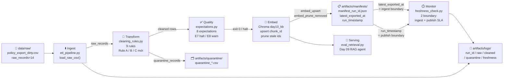

# Kiến trúc pipeline — Lab Day 10

**Nhóm:** Nhóm 71  
**Cập nhật:** 2026-04-15

---

## 1. Sơ đồ luồng



ASCII fallback (nếu Mermaid không render):

```
[RAW CSV]
    |
    v  load_raw_csv()           run_id ghi vào log, manifest, vector metadata
[Ingest / etl_pipeline.py]  ──────────────────────────────────────────────────────►  [artifacts/logs/]
    |  raw_records
    v
[Transform / cleaning_rules.py]  9 rules (baseline + Rule A/B/C)
    |                    |
    v                    v
[cleaned rows]     [quarantine rows] ──► [artifacts/quarantine/]
    |
    v
[Quality / expectations.py]  8 expectations (E1–E8, halt/warn)
    |         |
  PASS      FAIL halt ──► PIPELINE_HALT (exit 2) hoặc --skip-validate cho demo
    |
    v
[Embed / chromadb]  upsert chunk_id + prune stale ids
    |
    v
[artifacts/manifests/]
    |                   |
 latest_exported_at   run_timestamp
    |                   |
    └─────┬─────────────┘
          v
[Monitor / freshness_check.py]  PASS | WARN | FAIL × 2 boundary
          |
          v
[Serving / eval_retrieval.py / Day09 RAG agent]
```

Điểm đo freshness theo 2 boundary:

| Boundary | Trường manifest | Ý nghĩa | SLA |
|----------|----------------|---------|-----|
| **Ingest** | `latest_exported_at` | Khi nguồn DB export raw CSV | 24h |
| **Publish** | `run_timestamp` | Khi pipeline hoàn thành, embed xong | 24h |

---

## 2. Ranh giới trách nhiệm

| Thành phần | Input | Output | Owner nhóm |
|------------|-------|--------|------------|
| **Ingest** | `data/raw/policy_export_dirty.csv` | `List[Dict]` raw rows, `run_id`, log | Ingestion Owner |
| **Transform** | raw rows | cleaned rows + quarantine rows + `cleaned_*.csv` + `quarantine_*.csv` | Cleaning & Quality Owner |
| **Quality** | cleaned rows | `List[ExpectationResult]`, `halt` flag | Cleaning & Quality Owner |
| **Embed** | cleaned CSV + `run_id` | Chroma upsert `chunk_id`, prune stale, `embed_prune_removed` log | Embed Owner |
| **Monitor** | `manifest_*.json` | freshness status × 2 boundary → log | Monitoring / Docs Owner |

---

## 3. Idempotency & rerun

**Chiến lược upsert theo `chunk_id` (SHA-256 ổn định):**

```python
chunk_id = SHA-256(f"{doc_id}|{chunk_text}|{seq}")[:16]
```

- Xác định duy nhất mỗi chunk; ổn định qua rerun nếu input không đổi.
- `collection.upsert(ids=chunk_id, ...)` → rerun không tạo duplicate vector.
- Sau publish, pipeline lấy `prev_ids` từ Chroma, tính `drop = prev_ids − current_ids`, rồi `collection.delete(ids=drop)` → xóa vector lạc hậu (prune).

**Bằng chứng idempotency (sprint2 → sprint2-rerun):**

```
# sprint2:       embed_upsert count=7 collection=day10_kb
# sprint2-rerun: embed_upsert count=7, embed_prune_removed=0
```

→ Rerun cùng input không làm phình collection, không xóa nhầm.

**Bằng chứng prune (sprint3-clean sau inject-bad):**

```
# inject-bad: embed_upsert count=8 (8 vectors, gồm 1 HR stale + 1 refund stale)
# sprint3-clean: embed_prune_removed=5 → embed_upsert count=7
```

→ 5 vector dư từ inject-bad bị xóa khi restore về cleaned state (7 vectors).

---

## 4. Liên hệ Day 09

Day 09 ingest trực tiếp `data/docs/*.txt` vào một collection riêng, chưa qua cleaning pipeline. Day 10 bổ sung **tầng dữ liệu có kiểm soát**:

| Tiêu chí | Day 09 | Day 10 |
|----------|--------|--------|
| Nguồn dữ liệu | `data/docs/*.txt` (canonical) | `data/raw/policy_export_dirty.csv` (DB export mô phỏng) |
| Lớp cleaning | Không | 9 rules, quarantine CSV |
| Validation | Không | 8 expectations, halt/warn |
| Truy vết lineage | Không | `run_id` trong log + manifest + vector metadata |
| Collection | Day 09 collection | `day10_kb` (tách biệt) |

**Tích hợp lại Day 09:** đổi `CHROMA_COLLECTION=day10_kb` trong `.env` của Day 09 agent → agent đọc corpus đã qua cleaning + validation của Day 10.

---

## 5. Rủi ro đã biết

| Rủi ro | Ảnh hưởng | Giảm thiểu hiện tại |
|--------|-----------|---------------------|
| CSV export delay > 24h | `freshness_check ingest_boundary=FAIL` | Alert `slack:#data-ops-alert`; runbook mục Mitigation |
| BOM / ký tự điều khiển trong `chunk_text` | Embedding noise; chunk rỗng sau strip | Rule B: `strip_bom_and_control_chars` |
| HR policy stale (bản 2025) lọt index | Agent trả lời sai số ngày phép | Rule baseline 3 + E6; quarantine `stale_hr_policy_effective_date`; cutoff đọc từ `data_contract.yaml` |
| `chunk_id` trùng nếu cùng `doc_id|text|seq` | Upsert đúng chunk (idempotent by design) | Hành vi mong muốn — không phải rủi ro |
| Freshness chỉ đo publish nhưng ingest đã stale | Bỏ sót data nguồn cũ | Đo 2 boundary: `latest_exported_at` + `run_timestamp` |
